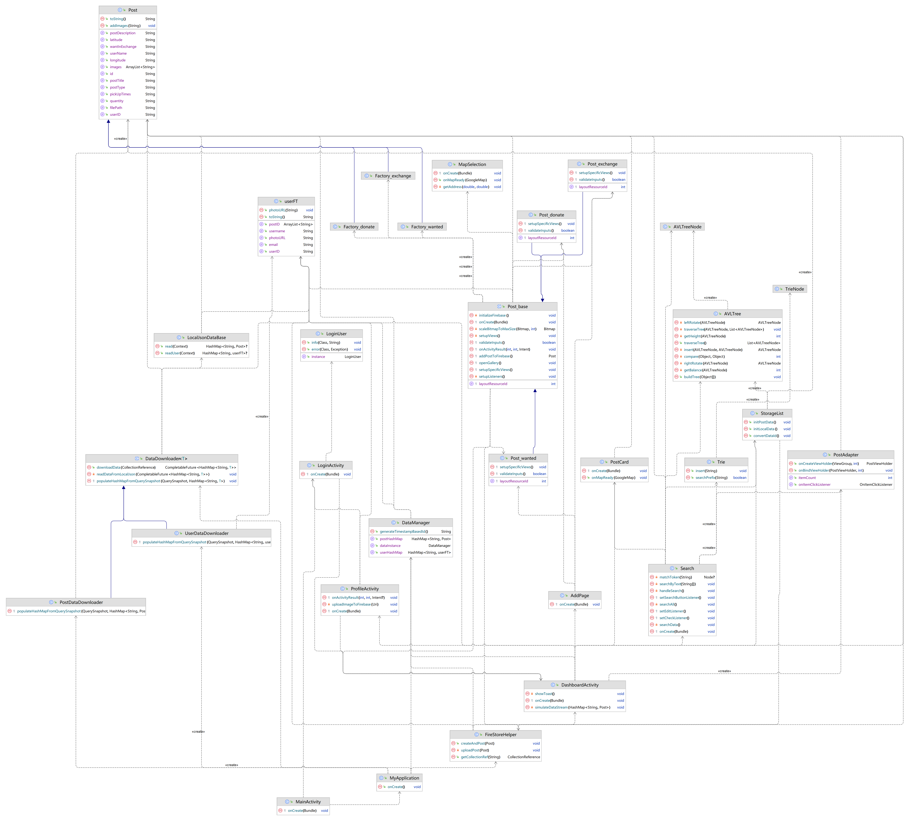

# [G0 - Team Name] Report

The following is a report template to help your team successfully provide all the details necessary for your report in a structured and organised manner. Please give a straightforward and concise report that best demonstrates your project. Note that a good report will give a better impression of your project to the reviewers.

Note that you should have removed ALL TEMPLATE/INSTRUCTION textes in your submission (like the current sentence), otherwise it hampers the professionality in your documentation.

*Here are some tips to write a good report:*

* `Bullet points` are allowed and strongly encouraged for this report. Try to summarise and list the highlights of your project (rather than give long paragraphs).*

* *Try to create `diagrams` for parts that could greatly benefit from it.*

* *Try to make your report `well structured`, which is easier for the reviewers to capture the necessary information.*

*We give instructions enclosed in square brackets [...] and examples for each sections to demonstrate what are expected for your project report. Note that they only provide part of the skeleton and your description should be more content-rich. Quick references about markdown by [CommonMark](https://commonmark.org/help/)*

## Table of Contents

1. [Team Members and Roles](#team-members-and-roles)
2. [Summary of Individual Contributions](#summary-of-individual-contributions)
3. [Application Description](#application-description)
4. [Application UML](#application-uml)
5. [Application Design and Decisions](#application-design-and-decisions)
6. [Summary of Known Errors and Bugs](#summary-of-known-errors-and-bugs)
7. [Testing Summary](#testing-summary)
8. [Implemented Features](#implemented-features)
9. [Team Meetings](#team-meetings)
10. [Conflict Resolution Protocol](#conflict-resolution-protocol)

## Administrative
- Firebase Repository Link: <insert-link-to-firebase-repository>
   - Confirm: I have already added comp21006442@gmail.com as a Developer to the Firebase project prior to due date.
- Two user accounts for markers' access are usable on the app's APK (do not change the username and password unless there are exceptional circumstances. Note that they are not real e-mail addresses in use):
   - Username: comp2100@anu.edu.au	Password: comp2100
   - Username: comp6442@anu.edu.au	Password: comp6442

## Team Members and Roles
The key area(s) of responsibilities for each member

| UID      |      Name       |                                                                                                                                                                                                                                Role |
|:---------|:---------------:|------------------------------------------------------------------------------------------------------------------------------------------------------------------------------------------------------------------------------------:|
| u7663368 | Vishakha Mathur | MainActivity, Login Activity, LoginUser (singleton pattern), Profile Activity and UI design(main page, login page, dashboard, profile page), uploading images on profile page from phone to firebase, singleton design pattern test |
| u7727175 |  Jinyang Zeng    |GPS，choose location function, DataStream-Load data，show data in dashboard, and Load data from local json，Generate post data from user input|
| u7777752 |     Lin Xi      |UI design (Search page and Search_detailed page), Tokenizer, Parser, Data Structure (Hashmap, AVLTree, Arraylist, Hashset, Trie), Data Fetching, Searching and filtering, Testing (Search), Design Patterns (Adapter, Builder) |
| u7773880 |   Zihan Yuan    |Add Activity, Post activity(post_donate, post_exchange, post_wanted), page redirection, two factory design patterns, Data Stream(get images from album and upload image to Firebase) |
| u7705128 |   Boxuan Lin     |Create 2600+ post instances and 2500 user accounts, storing all of the data in Firebase. Providing methods for downloading and updating data from Firebase. |

## Summary of Individual Contributions

Specific details of individual contribution of each member to the project.

Each team member is responsible for writing **their own subsection**.

A generic summary will not be acceptable and may result in a significant lose of marks.

*[Summarise the contributions made by each member to the project, e.g. code implementation, code design, UI design, report writing, etc.]*

*[Code Implementation. Which features did you implement? Which classes or methods was each member involved in? Provide an approximate proportion in pecentage of the contribution of each member to the whole code implementation, e.g. 30%.]*

*you should ALSO provide links to the specified classes and/or functions*
Note that the core criteria of contribution is based on `code contribution` (the technical developing of the App).

*Here is an example: (Note that you should remove the entire section (e.g. "others") if it is not applicable)*

1. **UID1, Name1**  I have 30% contribution, as follows:  
  - **Code Contribution in the final App**
    - Feature A1, A2, A3 - class Dummy: [Dummy.java](https://gitlab.cecs.anu.edu.au/comp2100/group-project/ga-23s2/-/blob/main/items/media/_examples/Dummy.java)
    - XYZ Design Pattern -  class AnotherClass: [functionOne()](https://gitlab.cecs.anu.edu.au/comp2100/group-project/ga-23s2/-/blob/main/items/media/_examples/Dummy.java#L22-43), [function2()](the-URL)
    - ... (any other contribution in the code, including UI and data files) ... [Student class](../src/path/to/class/Student.java), ..., etc.*, [LanguageTranslator class](../src/path/to/class/LanguageTranslator.java): function1(), function2(), ...   

  - **Code and App Design** 
    - [What design patterns, data structures, did the involved member propose?]*
    - [UI Design. Specify what design did the involved member propose? What tools were used for the design?]*   

  - **Others**: (only if significant and significantly different from an "average contribution") 
    - [Report Writing?] [Slides preparation?]*
    - [You are welcome to provide anything that you consider as a contribution to the project or team.] e.g., APK, setups, firebase*   
1. **U7777752, Lin Xi** I have 20% contribution, as follows: 
**Code Contribution in the final App**
   - Search feature(medium) - class Search:[Search.java](url) 
   - Search filter(easy) - class Search:[Search.java](url) - class activity_search:[activity_search.xml](url)
   - Data fetching - class StorageList:[StorageList.java](url)
   - Store data in AVLTree - class AVLTree:[AVLTree.java](url) - class AVLTreeNode:[AVLTreeNode.java](url)
   - Adapter pattern - class ListDataAdapter:[ListDataAdapter.java](url)
   - Display data - class PostDetailActivity:[PostDetailActivity.java](url) -class activity_post_detail:[activity_post_detail.aml](url) 

2. **U7705128, Boxuan Lin**  I have 20% contribution, as follows:  
  - **Code Contribution in the final App**
  - 
3. **U7663368, Vishakha Mathur** I have 20% contribution, as follows:  
  - **Code Contribution in the final App**
    - Login feature - class LoginActivity: [LoginActivity.java](https://gitlab.cecs.anu.edu.au/u7705128/gp-24s1/-/blob/main/src/app/src/main/java/com/example/eatsy/pages/LoginActivity.java).
    - Data Profile(displaying user details, uploading images to the firebase) - class ProfileAcitvity: [ProfileActivity.java](https://gitlab.cecs.anu.edu.au/u7705128/gp-24s1/-/blob/main/src/app/src/main/java/com/example/eatsy/ProfileActivity.java).
    - Singleton Design Pattern - class LoginUser: [LoginUser.java](https://gitlab.cecs.anu.edu.au/u7705128/gp-24s1/-/blob/main/src/app/src/main/java/com/example/eatsy/LoginUser.java#L8-34), [getInstance(), info(), error()](https://gitlab.cecs.anu.edu.au/u7705128/gp-24s1/-/blob/main/src/app/src/main/java/com/example/eatsy/LoginUser.java?ref_type=heads#L14).
    - Other contribution: [MainActivity class](https://gitlab.cecs.anu.edu.au/u7705128/gp-24s1/-/blob/main/src/app/src/main/java/com/example/eatsy/MainActivity.java?ref_type=heads), [DashboardActivity class](https://gitlab.cecs.anu.edu.au/u7705128/gp-24s1/-/blob/main/src/app/src/main/java/com/example/eatsy/DashboardActivity.java?ref_type=heads),
      UI design of [activity_main.xml](https://gitlab.cecs.anu.edu.au/u7705128/gp-24s1/-/blob/main/src/app/src/main/res/layout/activity_main.xml), [activity_login.xml](https://gitlab.cecs.anu.edu.au/u7705128/gp-24s1/-/blob/main/src/app/src/main/res/layout/activity_login.xml),
      [activity_dashboard.xml](https://gitlab.cecs.anu.edu.au/u7705128/gp-24s1/-/blob/main/src/app/src/main/res/layout/activity_dashboard.xml), [activity_profile.xml](https://gitlab.cecs.anu.edu.au/u7705128/gp-24s1/-/blob/main/src/app/src/main/res/layout/activity_dashboard.xml)
    **Code and App Design**
    - Singleton Design Pattern.
    - ScrollView, LinearLayout, Picasso, pictures and icons. 

4. **U7727175, Jinyang Zeng**  I have 20% contribution, as follows:  
- **Code Contribution in the final App**
  - Data Stream feature - class DashboardActivity: [DashboardActivity.java](https://gitlab.cecs.anu.edu.au/u7705128/gp-24s1/-/blob/main/src/app/src/main/java/com/example/eatsy/DashboardActivity.java), class PostAdapter: [PostAdapter.java](https://gitlab.cecs.anu.edu.au/u7705128/gp-24s1/-/blob/main/src/app/src/main/java/com/example/eatsy/PostAdapter.java), function [addPostToFirbase()](https://gitlab.cecs.anu.edu.au/u7705128/gp-24s1/-/blob/main/src/app/src/main/java/com/example/eatsy/post_base.java?ref_type=heads#L48-115)
  - GPS feature - class postCard: [postCard.java](https://gitlab.cecs.anu.edu.au/u7705128/gp-24s1/-/blob/main/src/app/src/main/java/com/example/eatsy/postCard.java), class MapSelection:[MapSelection.java](https://gitlab.cecs.anu.edu.au/u7705128/gp-24s1/-/blob/main/src/app/src/main/java/com/example/eatsy/MapSelection.java)
  - Other contribution: [ImportDataFromLocalJson.java](https://gitlab.cecs.anu.edu.au/u7705128/gp-24s1/-/blob/main/src/app/src/main/java/com/example/eatsy/ImportDataFromLocalJson.java),  [Dashboard.java](https://gitlab.cecs.anu.edu.au/u7705128/gp-24s1/-/blob/main/src/app/src/main/java/com/example/eatsy/DashboardActivity.java) 
  - UI design of [activity_map_selection.xml](https://gitlab.cecs.anu.edu.au/u7705128/gp-24s1/-/blob/main/src/app/src/main/res/layout/activity_map_selection.xml), [activity_post_card.xml](https://gitlab.cecs.anu.edu.au/u7705128/gp-24s1/-/blob/main/src/app/src/main/res/layout/activity_post_card.xml), [item_post.xml](https://gitlab.cecs.anu.edu.au/u7705128/gp-24s1/-/blob/main/src/app/src/main/res/layout/item_post.xml)
  - 
    **Code and App Design**
  - Singleton Design Pattern.
  - ScrollView, LinearLayout, Picasso, pictures and icons.
5. **U7773880, Zihan Yuan**  I have 20% contribution, as follows:  
- **Code Contribution in the final App**
  - LoadShowData - class Post_base to upload and show images: [Post_base.java](https://gitlab.cecs.anu.edu.au/u7705128/gp-24s1/-/blob/main/src/app/src/main/java/com/example/eatsy/Post_base.java?ref_type=heads)
  - UI-Layout: modify most of the pages to incorporate layout adjustments in the UI components for portrait and landscape
    layout variants, as well as different screen sizes.
  - UI-Test: [PostdonateUITest.java](https://gitlab.cecs.anu.edu.au/u7705128/gp-24s1/-/blob/main/src/app/src/androidTest/java/com/example/eatsy/PostdonateUITest.java?ref_type=heads), [PostexchangeUITest](https://gitlab.cecs.anu.edu.au/u7705128/gp-24s1/-/blob/main/src/app/src/androidTest/java/com/example/eatsy/PostexchangeUITest.java?ref_type=heads), [PostwantedUITest](https://gitlab.cecs.anu.edu.au/u7705128/gp-24s1/-/blob/main/src/app/src/androidTest/java/com/example/eatsy/PostwantedUITest.java?ref_type=heads).
  - Design Pattern: factory design patter: [Post_base.java](https://gitlab.cecs.anu.edu.au/u7705128/gp-24s1/-/blob/main/src/app/src/main/java/com/example/eatsy/Post_base.java), 
[Factory_donate.java](https://gitlab.cecs.anu.edu.au/u7705128/gp-24s1/-/blob/main/src/app/src/main/java/com/example/eatsy/Factory_donate.java)
, [Factory_exchange.java](https://gitlab.cecs.anu.edu.au/u7705128/gp-24s1/-/blob/main/src/app/src/main/java/com/example/eatsy/Factory_exchange.java)
, [Factory_wanted.java](https://gitlab.cecs.anu.edu.au/u7705128/gp-24s1/-/blob/main/src/app/src/main/java/com/example/eatsy/Factory_wanted.java)
, [Post_donate](https://gitlab.cecs.anu.edu.au/u7705128/gp-24s1/-/blob/main/src/app/src/main/java/com/example/eatsy/pages/Post_donate.java)
, [Post_exchange](https://gitlab.cecs.anu.edu.au/u7705128/gp-24s1/-/blob/main/src/app/src/main/java/com/example/eatsy/pages/Post_exchange.java)
, [Post_wanted](https://gitlab.cecs.anu.edu.au/u7705128/gp-24s1/-/blob/main/src/app/src/main/java/com/example/eatsy/pages/Post_wanted.java)
  - UI design: [activity_addpage.xml](https://gitlab.cecs.anu.edu.au/u7705128/gp-24s1/-/blob/main/src/app/src/main/res/layout/activity_addpage.xml)
, [activity_post_donate.xml](https://gitlab.cecs.anu.edu.au/u7705128/gp-24s1/-/blob/main/src/app/src/main/res/layout/activity_post_donate.xml),
, [activity_post_exchange.xml](https://gitlab.cecs.anu.edu.au/u7705128/gp-24s1/-/blob/main/src/app/src/main/res/layout/activity_post_exchange.xml), [activity_post_wanted.xml](https://gitlab.cecs.anu.edu.au/u7705128/gp-24s1/-/blob/main/src/app/src/main/res/layout/activity_post_wanted.xml)
  - Other contribution: [Addpage.java](https://gitlab.cecs.anu.edu.au/u7705128/gp-24s1/-/blob/main/src/app/src/main/java/com/example/eatsy/pages/AddPage.java), 
[Post.java](https://gitlab.cecs.anu.edu.au/u7705128/gp-24s1/-/blob/main/src/app/src/main/java/com/example/eatsy/Post.java)
- **Code and App Design**
    - UI-design: I designed a transparent add page for user to post, and three types of Post page. All of the icons come from [Icons8](https://icons8.com/).

## Application Description

*[What is your application, what does it do? Include photos or diagrams if necessary]*

*Here is a pet specific application example*
EATSY is a platform where people can donate, exchange, ask for food ensuring responsible consumption and support the people who are in need. It focuses on the UN sustainable goal of zero hunger and responsible consumption and production.

### Main Page

This is the main page that appears when we start the app. The button takes us to the login page. 

  

### Login Page

On this page, user is asked to fill his credentials login the app. 

 

### DashBoard Page
On this page, a user can see all sorts of posts. It can also take you to profile page. The add 
button opens 'Add page' where user can post something. It has a search icon brings the search page on click.

  

### Profile Page
This page displays the user details such as user's name and password. It also allows the user to manage his profile picture and sign out from the app. 

   

### Add page
Add page with a transparancy background. Users can chosse three types of post.

    

### Post pages
Post have three different type: donate, exchange and wanted.
1. Donate Page
   - Purpose: Allows users to create posts where they offer items as donation.
   - Photo Selection: Users are required to select photos from their album. This provides a clear idea of the item being donated.
   - Form Details: Users fill out a form including the item's title, description, quantity, pickup time, and pickup location.
   - Post Submission: Once the form is validated, the donation details are added to Firebase, making the post accessible to other users.

    

2. Exchange Page
   - Purpose: Designed for users who want to exchange items with others.
   - Photo Selection: Similar to the donation page, users must upload photos of the items they wish to exchange.
   - Form Details: Users provide specifics such as the item's title, description, and the type of item they are willing to receive in exchange.
   - Post Submission: The validated exchange details are submitted to Firebase, making the post available to other users.

    

3. Wanted Page
   - Purpose: Allows users to post about items they want. This could be a request for donations or an expression of interest in exchanging for items.
   - No Photo Requirement: Unlike the other pages, the wanted page does not require users to upload photos.
   - Form Details: Users provide specifics including a description, the desired quantity, and the preferred pickup location.
   - Post Submission: The validated request is then added to Firebase, where it can be viewed by other users.

    

Post pages share a common theme of promoting community sharing and exchange, and we use Firebase to manage data storage and retrieval effectively.

4.插入search page:

On this page, users can search for any food they want and choose how to get the food (i.e. donate, wanted and exchange).
When the user types in the food they want and selects any option, our app will retrieve the relevant data from the firebase database and display it.
When the user types in the food they want and selects any option, our app will retrieve the relevant data from the firebase database and display it.

插入search之后的page：apple

When the user types apple and selects the donate type, our app will pick up the post_type as donate from firebase, and apple's post will appear in the post_title.

插入search之后的page:butter chicken

When the user types apple and selects the exchange and donate types, our app will pick up the post_type as donate and exchange from firebase, and the post_title of butter chicken will appear.

插入search之后的page：I want a banana

When the user types want and selects the wanted type, our app will pick up the post_type as wanted from firebase, and the post I or want or a or banana will appear in the post_title.

5.插入点进详情页的page：

When we click on any post under the search term, we can see the specific content of the post.
  
### Application Use Cases and or Examples

*[Provide use cases and examples of people using your application. Who are the target users of your application? How do the users use your application?]*

*Here is a pet training application example*

*Molly wants to inquiry about her cat, McPurr's recent troublesome behaviour*
1. *Molly notices that McPurr has been hostile since...*
2. *She makes a post about... with the tag...*
3. *Lachlan, a vet, writes a reply to Molly's post...*
4. ...
5. *Molly gives Lachlan's reply a 'tick' response*

*Here is a map navigation application example*

*Targets Users: Drivers*

* *Users can use it to navigate in order to reach the destinations.*
* *Users can learn the traffic conditions*
* ...

*Target Users: Those who want to find some good restaurants*

* *Users can find nearby restaurants and the application can give recommendations*
* ...

*List all the use cases in text descriptions or create use case diagrams. Please refer to https://www.visual-paradigm.com/guide/uml-unified-modeling-language/what-is-use-case-diagram/ for use case diagram.*

 

### Application UML

## Code Design and Decisions

This is an important section of your report and should include all technical decisions made. Well-written justifications will increase your marks for both the report as well as for the relevant parts (e.g., data structure). This includes, for example,

- Details about the parser (describe the formal grammar and language used)

- Decisions made (e.g., explain why you chose one or another data structure, why you used a specific data model, etc.)

- Details about the design patterns used (where in the code, justification of the choice, etc)

*Please give clear and concise descriptions for each subsections of this part. It would be better to list all the concrete items for each subsection and give no more than `5` concise, crucial reasons of your design.

### **Tokenizer and parser**

### **Parser**

**Grammar**

The grammar used in our project is designed to parse text consisting of space-separated words. The parser constructs a parse tree where each node represents a word and its children represent the words that follow it in the sequence.

**Advantages of the design**:

- **Simplicity**: The grammar is simple and straightforward, making it easy to implement and debug.
- **Extensibility**: While the current grammar is simple, it can be extended to include more complex features such as handling different types of tokens or incorporating operator precedence without a complete overhaul.

**Production Rules**:

- **Expression**::= Term { " " Term }
- **Term**::= Word

**Term** represents individual words, and **Expression** represents sequences of these words. An expression consists of one or more terms separated by spaces.

**Usage**:

- **Tokenizer**: The tokenizer in my project breaks down the input string into tokens based on spaces. Each token is either a word or a space. This tokenizer is utilized in the **matchToken**function within **Search** class to preprocess the input for parsing.
- **Parser**: The parser is used to construct a parse tree from the sequence of tokens generated by the tokenizer. It processes the tokens to build a hierarchical structure that represents the sequence in which words appear in the input.

**Construction**: 

- **Tokenizer**: It is implemented using simple string operations. The input string is split using the space character as a delimiter, generating an array of words which are then individually wrapped as **Token**

- **Parser**: The parser is implemented as a recursive descent parser. It starts by creating a node for the first token and then recursively processes the following tokens to build the tree. The recursive nature of the parser allows it to easily handle nested or sequential structures typical in language constructs.

**Advantages of the designs**:

- **Efficiency**: The tokenizer is efficient as it leverages built-in string methods which are optimized for performance.
- **Flexibility**: The parser is designed to be flexible and can be easily adjusted or extended to support more complex grammatical structures if needed.
- **Modularity**: The separation of tokenizing and parsing functions enhances modularity. This makes the code easier to manage and test, as each component can be developed and debuged independently.

**Scalability**: The parser uses recursive methods, making it scalable for extending the grammar without significantly altering the existing codebase. This is beneficial for maintaining and upgrading the system in the future.

### Data Structures

*[What data structures did your team utilise? Where and why?]*

Here is a partial (short) example for the subsection `Data Structures`:*

*I used the following data structures in my project:*

1. *LinkedList*
   * *Objective: used for storing xxxx for xxx feature.*
   * *Code Locations: defined in [Class X, methods Z, Y](https://gitlab.cecs.anu.edu.au/comp2100/group-project/ga-23s2/-/blob/main/items/media/_examples/Dummy.java#L22-43) and [class AnotherClass, lines l1-l2](url); processed using [dataStructureHandlerMethod](url) and ...
   * *Reasons:*
      * *It is more efficient than Arraylist for insertion with a time complexity O(1)*
      * *We don't need to access the item by index for xxx feature because...*
      * For the (part), the data ... (characteristics) ...

2. **HashMap**

- Objective: Used for storing and quickly accessing `Post` objects by their IDs within the `StorageList` class.
- Code Location: Defined in `StorageList` class. Utilized in methods such as `initPostData` and `initLocalData` to store and access `Post` instances.
- Reasons:
- Efficiency: `HashMap` offers O(1) time complexity for insertions and lookups, which is more efficient than an `ArrayList` for these operations.
- Key-value Access: For features like updating or retrieving `Post` data, direct access via post IDs (keys) is essential, eliminating the need for indexing which is crucial for performance.

3. **ArrayList**

- Objective: Used for storing lists of `Post` objects in a dynamically resizing array format, suitable for ordered collection which also supports random access.
- Code Locations: Utilized in `StorageList` and `Search` classes, particularly in methods like `initPostData` and `searchAll` for storing and managing collections of posts.
- Reasons:
- Random Access: Unlike `LinkedList`, `ArrayList` provides efficient random access to elements, which is beneficial where elements are frequently accessed by index.

4. **HashSet**

- Dynamics and Performance: Better performance in terms of memory as it stores items in a contiguous memory space and is generally faster in iterating over elements compared to `LinkedList`.
- Objective: Used in the `Search` class to ensure uniqueness and efficient lookup for `Post` objects when performing search operations.
- Code Locations: Used in the `searchByTest` method of the `Search` class to store unique results from keyword-based searches.
- Reasons:
- Uniqueness: Automatically prevents duplication of `Post` objects in search results.
- Efficiency: Offers O(1) complexity for add and check operations, ideal for scenarios where the integrity of uniqueness is more critical than ordering.

5. **AVLTree**

- Objective: Utilized to maintain a balanced search tree of `Post` objects, ensuring efficient order operations and balanced tree properties for quick search and retrieval.
- Code Locations: `StorageList` class uses `AVLTree` to manage posts in a sorted manner, particularly evident in the `buildTree` and `traverseTree` methods.
- Reasons:
- Balanced Search Operations: `AVLTree` maintains balance with rotations, providing O(log n) complexity for insertions, deletions, and searches.
- Ordering: Maintains elements in a sorted order, which is beneficial for range queries and ordered data retrieval operations.

### Design Patterns
*[What design patterns did your team utilise? Where and why?]*

1. *xxx Pattern*
   * *Objective: used for storing xxxx for xxx feature.*
   * *Code Locations: defined in [Class X, methods Z, Y](https://gitlab.cecs.anu.edu.au/comp2100/group-project/ga-23s2/-/blob/main/items/media/_examples/Dummy.java#L22-43) and [class AnotherClass, lines l1-l2](url); processed using [dataStructureHandlerMethod](url) and ...
   * *Reasons:*
      * ...
1. Factory – post 

    * **Objective**: used for obtaining content from user input and convert it into a post class.
    
    * **Code Locations**: defined in [Class Post](https://gitlab.cecs.anu.edu.au/u7705128/gp-24s1/-/blob/main/src/app/src/main/java/com/example/eatsy/Post.java?ref_type=heads),[Class factory_donate](https://gitlab.cecs.anu.edu.au/u7705128/gp-24s1/-/blob/main/src/app/src/main/java/com/example/eatsy/post_donate.java?ref_type=heads),[Class factory_exchange](https://gitlab.cecs.anu.edu.au/u7705128/gp-24s1/-/blob/main/src/app/src/main/java/com/example/eatsy/factory_exchange.java?ref_type=heads) and [Class factory_wanted](https://gitlab.cecs.anu.edu.au/u7705128/gp-24s1/-/blob/main/src/app/src/main/java/com/example/eatsy/factory_wanted.java?ref_type=heads).
    
    * **Reasons**: We have three types of posts: Donate, Exchange and Wanted. Each type has specific functionalities. The factory pattern can be used to create an interface for creating instances of these different posts and uploading these posts’ details. By using this, we simplify the way to handle post creation and uploading posts.
2. Factory – render scene
    
3. Singleton Design Pattern
    **Objective** : We implemented singleton design pattern in the LoginUser class because there is only one instance of LoginUser required. 
    **Code Locations**: defined in [Class LoginUser, method getInstance, info and error](https://gitlab.cecs.anu.edu.au/u7705128/gp-24s1/-/blob/main/src/app/src/main/java/com/example/eatsy/LoginUser.java?ref_type=heads#L8-34).
    **Reasons** : This class is used for user information and error messages that can be helpful to debug and check errors.

4. Adapter Pattern 
**Objective:** Allows objects with incompatible interfaces to collaborate. 
**Code Locations:**
- Used in the ListDataAdapter class, which adapts a list of Post objects to be usable in a ListView which expects data in a specific format. 
**Reasons:** 
- Interface Compatibility: Converts the interface of the List<Post> into the interface expected by the ListView, enabling seamless integration of complex data structures with UI components.
- Reusability: Allows the same Post data to be reused in different list-based UI components without modifying the underlying data structure or the components themselves.

5. Builder Pattern 
**Objective:** Separates the construction of a complex object from its representation so that the same construction process can create different representations. 
**Code Locations:** Used in constructing complex Post objects, in scenarios where a Post object consists of various discrete parts that are assembled step-by-step. 
**Reasons:** Step-by-step Construction: Allows for constructing complex objects step-by-step, particularly useful when creating an object requires setting many attributes that could be optional. 
### Others

*[What other design decisions have you made which you feel are relevant? Feel free to separate these into their own subheadings.]*

 

## Implemented Features
*[What features have you implemented? where, how, and why?]*  
*List all features you have completed in their separate categories with their featureId. THe features must be one of the basic/custom features, or an approved feature from Voice Four Feature.*

### Basic Features
1. [LogIn]. 	Created an activity for login feature and used firebase authentication to help user log in. (easy)
   * Code: [Class LoginActivity, methods X, Y](https://gitlab.cecs.anu.edu.au/u7705128/gp-24s1/-/blob/main/src/app/src/main/java/com/example/eatsy/LoginActivity.java#L25-85) and Class LoginUser
   * Implemented a singlton design pattern in LoginUser java class to ensure that only one instance of LoginUser required. 
   * Description of your implementation: ...  

2. [DataFiles]. Description  ... ... (...)
   * Code to the Data File [users_interaction.json](link-to-file), [search-queries.xml](link-to-file), ...
   * Link to the Firebase repo: ...

3. [Search].(Medium) Created an activity for searching and filtering posts within the application, utilizing various data structures and methods to efficiently manage and display search results.
   * Code:[class Search](url)
   * Key Methods: onCreate, setCheckListener, setEditListener, searchData, searchAll, searchByTest
   * Related Classes: StorageList, ListDataAdapter, AVLTree, AVLTreeNode, Trie, TrieNode

**Description of Implementation**

   * The Search activity is designed to process user input for searching and filtering posts based on categories like "Donate", "Need", and "Exchange". The functionality is extended by integrating Firebase Firestore to fetch real-time data, ensuring up-to-date information is always available.
   * Main Features:
   * Dynamic Filtering: Users can filter search results in real-time by selecting different categories through checkboxes. The application updates the displayed results immediately based on the selected criteria.
   * Keyword Search: Includes an input field where users can type keywords. The application parses these inputs to filter posts containing relevant information. This feature uses a custom tokenizer and parser to handle the input strings efficiently.

**Data Structure Usage**

   * HashMap: Used to store and quickly retrieve posts by unique identifiers.
   * ArrayList: Manages lists of posts for display and intermediate operations.
   * HashSet: Ensures unique search results, preventing duplicate entries in the display.
   * AVLTree: Maintains posts in a balanced manner to optimize search and retrieval operations based on sorted or ranked criteria.

**Performance Considerations**

   * The use of efficient data structures like HashMap and AVL Tree ensures that search operations are fast and responsive, even with a large dataset. The Singleton pattern in StorageList minimizes redundancy in data management, thereby improving memory usage and speed.

**Security and Data Integrity**

   * All interactions with Firebase are managed through secure authenticated sessions, ensuring that data retrieval and manipulation are protected against unauthorized access.This implementation not only fulfills the basic requirements of a search feature but also enhances user experience through quick responsiveness and accurate results. The modular approach in designing the Search class allows for easier maintenance and scalability, adapting to potential future enhancements like more complex search algorithms or additional filtering criteria.

### Custom Features
Feature Category: Firebase Integration  
1. [FB-Auth] Description of the feature (easy)
   * Code: [Class X, entire file](https://gitlab.cecs.anu.edu.au/comp2100/group-project/ga-23s2/-/blob/main/items/media/_examples/Dummy.java#L22-43) and Class Y, ...
   * [Class B](../src/path/to/class/file.java#L30-85): methods A, B, C, lines of code: 30 to 85
   * Description of your implementation: ...  
2. [Data-Profile] Created a ProfileActivity that displays name and email addresses of the user(easy).
   * Code: [Class ProfileActivity, methods onActivityResult(), uploadImageToFirebase(), showing userdetails](https://gitlab.cecs.anu.edu.au/u7705128/gp-24s1/-/blame/main/src/app/src/main/java/com/example/eatsy/ProfileActivity.java?ref_type=heads#L47-220).
   * Description of the code.

Feature Category: Search-related features  

Feature Category: UI Design and Testing  
3. [UI-Layout] Incorporate suitable layout adjustments in the UI components for portrait and landscape
   layout variants, as well as different screen sizes. (easy)
    * Code: [all of xml files](https://gitlab.cecs.anu.edu.au/u7705128/gp-24s1/-/tree/main/src/app/src/main/res/layout?ref_type=heads)
    * Description of your implementation: set appropriate constraints to all components to fit for portrait and landscape
      layout variants, and different screen sizes
4. [UI-Test] Complete UI tests using espresso (not covered in lectures/labs) of reasonable quality and
   coverage of the App. (hard)
    * Code: [all of UI Test files](https://gitlab.cecs.anu.edu.au/u7705128/gp-24s1/-/tree/main/src/app/src/androidTest/java/com/example/eatsy?ref_type=heads)
    * Description of your implementation: UI tests are implemented using Espresso and JUnit to ensure functionality and user across various activities. 
Each test corresponds to different aspects of the app, such as adding pages, managing dashboards, user authentication and posts. 
These tests are designed for enhancing usability, and ensuring user experiences across pages.

Feature Category: Greater Data Usage, Handling and Sophistication  

  
5. [DataFiles] Boxuan Lin created a dataset with more than 2600 post data instances, covering all types of posts. All of the data was formatted in JSON and uploaded to Firestore for persistence.

6. [FB-Auth] (By Boxuan Lin) We use Firebase to implement the User Authentication/Authorisation of our app. User account data is stored on Google servers instead of locally, and is processed by Google, ensuring security.
7. [FB-Persist] (By Boxuan Lin) We used Firebase’s Firestore, a real-time, scalable database that stores data in collections and documents. We use it to persist the post data and user’s profile data for a well synchronization function.  For big files like photos, we store them in Cloud Storage for Firebase for its high scalability and simplified file upload and download capabilities.
Data Profile(easy):
      1. 
    2. It also gives the user an option to upload and change profile picture via media gallery to the firebase.
 3. There is sign out button that allows user to sign out from the app. 

8. [Search-Invalid] (By Lin Xi)(Medium)

      Handling Partially Valid and Invalid Search Queries
Objective: Enhance the search functionality to handle both partially valid and invalid search queries effectively without causing the application to crash, while still providing meaningful search results based on valid parts of the query.

      Subject: Partially valid and invalid search query handling.

      Description: The search feature of the application is designed to robustly handle errors in user input, ensuring that the application remains stable and responsive even when faced with partially valid or invalid search queries. The feature aims to parse user inputs and extract usable information to return the best possible results.

      What the feature entails:

      Modifying the Tokenizer/Parser: The application's tokenizer and parser have been enhanced to more effectively identify and separate valid elements from invalid inputs. This allows the application to process and respond to mixed-quality queries by ignoring or flagging invalid tokens while utilizing valid tokens for search operations.

      Error Handling Mechanisms: Implementations include try-catch blocks, input validation, and error logging to manage unexpected or malformed inputs gracefully.

      Feedback to Users: When invalid inputs are detected, the application provides feedback to the user, suggesting corrections or clarifying what parts of the query were processed.

      Feature Relevance: Tokenization and parsing are crucial for dissecting user input into manageable components that the system can understand and process, which is central to this feature.

      Search-Filter: Sorting and Filtering Search Results
Objective: Implement functionality to sort and filter the list of items returned from searches, utilizing suitable UI components to allow users to refine their search results dynamically.

      Subject: Advanced sorting and filtering of search results.

      Description: This feature allows users to sort and filter search results based on various criteria such as date, relevance, type, etc. The implementation includes UI components that users interact with, such as dropdowns, checkboxes, and sliders, to adjust the filtering parameters dynamically.

      What the feature entails:

      Dynamic UI Components: Implement dropdown menus for sorting (e.g., ascending, descending), checkboxes for filtering specific types of posts (e.g., donations, requests), and sliders for range selections (e.g., date ranges, quantities).

      Backend Logic: Enhance the search mechanism to respond to these filters, sorting the internal data structures like ArrayLists and updating the display according to user preferences.

      Live Updates: The search results update in real-time as users adjust the filters, providing an interactive and responsive user experience.

      Feature Relevance: The ability to sort and filter enhances the usability of the search function, allowing users to more easily navigate large sets of data and find the items that best match their needs.

### Surprise Features
1. Classes were given meaning names like LoginActivity, DashboardActivity, since earlier they were named as MainActivity 3 and MainActivity 4.
2. On April 22 and 27, three post pages were completed, as documented in Git commits SHA 1c750dd020486de45f2d71d651badedf155ed79c and 7ff755054cffd14a9f85094c56854b77540ebf31.
 The layout of these three posts was very similar, especially the donate and exchange pages, including nearly identical scenes, UI components and listeners.
 This resulted in a significant amount of code duplication. Subsequently, on May 1st, Git commit SHA ea0f48b72edbbfc472b0a74f6aa94d1ccebdc8ac added [Post_base.java](https://gitlab.cecs.anu.edu.au/u7705128/gp-24s1/-/blob/main/src/app/src/main/java/com/example/eatsy/Post_base.java?ref_type=heads),
which integrates the methods in these pages into a single base class. This refactoring improved the code by reducing redundancy and improving maintainability.
3. 
4. 
-   

## Summary of Known Errors and Bugs

*[Where are the known errors and bugs? What consequences might they lead to?]*
*List all the known errors and bugs here. If we find bugs/errors that your team does not know of, it shows that your testing is not thorough.*

*Here is an example:*

1. *Bug 1:*
   - *A space bar (' ') in the sign in email will crash the application.*
   - ...

2. *Bug 2:*
   - Error encountered in all pages containing the method 'FirebaseAuth.getInstance().getCurrentUser().getEmail()' during UI tests. This issue arises because the 'getCurrentUser()' method returns null when pages are run individually in testing.
Despite I attempted to resolve this using Mockito and Mockito-inline, the problem persists.
       

## Testing Summary

*[What features have you tested? What is your testing coverage?]*
*Please provide some screenshots of your testing summary, showing the achieved testing coverage. Feel free to provide further details on your tests.*

*Here is an example:*

1. Tests for Search
   - Code: [TokenizerTest Class, entire file](https://gitlab.cecs.anu.edu.au/comp2100/group-project/ga-23s2/-/blob/main/items/media/_examples/Dummy.java) for the [Tokenizer Class, entire file](https://gitlab.cecs.anu.edu.au/comp2100/group-project/ga-23s2/-/blob/main/items/media/_examples/Dummy.java#L22-43)
   - *Number of test cases: ...*
   - *Code coverage: ...*
   - *Types of tests created and descriptions: ...*

2. Tests for Singleton Design Pattern 
   - Code: [SingletonTest Class, entire file](https://gitlab.cecs.anu.edu.au/u7705128/gp-24s1/-/blob/main/src/app/src/test/java/com/example/eatsy/SingletonTest.java?ref_type=heads#L14-55).
   - *Number of test cases: 3*
   - Code coverage: Login feature of the app.
   - Test for same instance, 

3. Tests for factory design pattern
   - Code: [FactoryTest.java, entire file](https://gitlab.cecs.anu.edu.au/u7705128/gp-24s1/-/blob/main/src/app/src/test/java/com/example/eatsy/FactoryTest.java?ref_type=heads).
   - Number of test cases: 2
   - Code coverage: Coverage of all possible paths and conditions in the factory methods
   - Types of tests created and descriptions: The tests primarily focus on object construction correctness, ensuring that the factory methods create objects based on input parameters.
4. Tests for UI design(Post pages)
   - Code: [PostdonateUITest.java](https://gitlab.cecs.anu.edu.au/u7705128/gp-24s1/-/blob/main/src/app/src/androidTest/java/com/example/eatsy/PostdonateUITest.java?ref_type=heads),
[PostexchangeUITest.java](https://gitlab.cecs.anu.edu.au/u7705128/gp-24s1/-/blob/main/src/app/src/androidTest/java/com/example/eatsy/PostexchangeUITest.java?ref_type=heads) and 
[PostwantedUITest.java](https://gitlab.cecs.anu.edu.au/u7705128/gp-24s1/-/blob/main/src/app/src/androidTest/java/com/example/eatsy/PostwantedUITest.java?ref_type=heads)
   - Number of test cases: 18
   - Code coverage: Tests interactions with UI components
   - Types of tests created and descriptions: 
     - Visibility and changes of UI components. 
     - Intent firing and activity lifecycle management. 
     - Input validations and response actions.
  

## Team Management

### Meetings Records
* Link to the minutes of your meetings like above. There must be at least 4 team meetings.
  (each commited within 2 days aftre the meeting)
* Your meetings should also have a reasonable date spanning across Week 6 to 11.*

- [Team Meeting 1](Meeting-No1.md)
- [Team Meeting 2](Meeting-No2.md)
- [Team Meeting 3](Meeting-No3.md)
- [Team Meeting 4](Meeting-No4.md)
- [Team Meeting 5](Meeting-No5.md)
- [Team Meeting 6](Meeting-No6.md)

### Conflict Resolution Protocol
1. Form a culture of openness and transparency, encouraging team members to voice their thought.
2. Out team votes on the ideas. When conflicts happens, we cast a vote. Then the idea with the majority vote is selected.
3. Holding regular Saturday meetings to keep everyone aligned and address any occurred issues or adjustments needed in future plans.
4. When it comes to managing conflicts in code, we review the conflicting codes together and decide on the best resolution.
